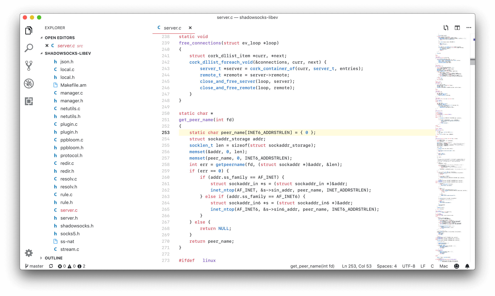
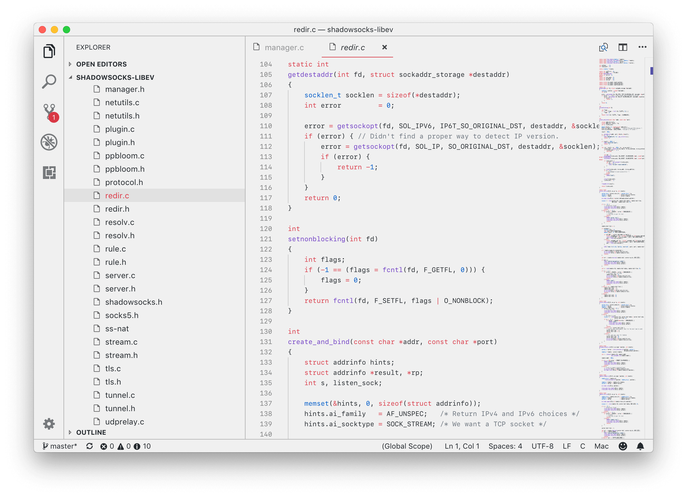

# Github Light Theme 

<!-- [](https://github.com/hyzeta)
[](mailto:hyzeta@outlook.com)

[](https://github.com/Hyzeta/vscode-theme-github-light)
[](https://github.com/Hyzeta/vscode-theme-github-light/issues)
[](https://github.com/Hyzeta/vscode-theme-github-light/pulls) -->

Try this light theme if others don't meet your needs.

[](https://github.com/chuling/vscode-theme-github-light/stargazers)

* [GitHub repository](https://github.com/chuling/vscode-theme-github-light.git)
* [Visual Studio Code marketplace](https://marketplace.visualstudio.com/items?itemName=Hyzeta.vscode-theme-github-light)

## Screenshot

### Origin pure white background: Github Light Theme



### Gray background: Github Light Theme - Gray



## Tips

If you are using MacBook, and your system is macOS 10.14+, these global settings will give you a better experience.

```json
{
    "editor.fontWeight": "500",
    "terminal.integrated.fontWeight": "500",
    "editor.lineHeight": 20
}
```

## License

Copyright 2016-2019 chuling \<genling.li@outlook.com\>

Licensed under either of

 * Apache License, Version 2.0
   ([LICENSE-APACHE](LICENSE-APACHE) or http://www.apache.org/licenses/LICENSE-2.0)
 * MIT license
   ([LICENSE-MIT](LICENSE-MIT) or http://opensource.org/licenses/MIT)

at your option.

## Contribution

Unless you explicitly state otherwise, any contribution intentionally submitted
for inclusion in the work by you, as defined in the Apache-2.0 license, shall be
dual licensed as above, without any additional terms or conditions.
